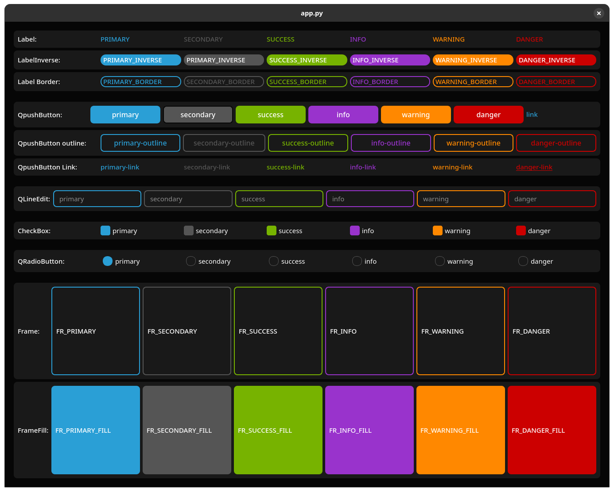

# joStyles - Um tema moderno para PySide/PyQt

`joStyles` é uma biblioteca de estilos que aplica um tema escuro (dark) elegante e customizável para aplicações desenvolvidas com PySide ou PyQt. A biblioteca utiliza um arquivo QSS (similar a CSS) com placeholders de cores, permitindo uma personalização rápida e fácil diretamente do seu código Python.

## Exemplo Visual



## Funcionalidades

- **Tema Escuro Moderno:** Um visual agradável e profissional para suas aplicações desktop.
- **Fácil de Usar:** Aplique o tema com apenas duas linhas de código.
- **Customizável:** Altere todo o esquema de cores editando um simples dicionário em Python.
- **Estilos Pré-definidos:** Utilize constantes para aplicar estilos a botões, labels, campos de texto e frames, como `primary`, `success`, `danger`, etc.

## Como Usar

Para utilizar o `joStyles` no seu projeto, basta carregar a folha de estilos e aplicá-la à sua `QApplication`. Você pode então usar os nomes de objeto definidos para estilizar seus widgets.

1.  **Importe** a função `load_style` e as constantes do módulo `style`.
2.  **Carregue e aplique** o estilo na sua instância de `QApplication`.
3.  **Defina o nome do objeto** (`setObjectName`) nos seus widgets para aplicar um estilo específico.

### Exemplo de código

```python
import sys
# Use PySide6, PyQt6, PySide2, etc.
from PySide6.QtWidgets import QApplication, QMainWindow, QPushButton, QVBoxLayout, QWidget
# 1. Importe o necessário do joStyles
from joStyles.style import load_style, PRIMARY, SUCCESS, DANGER_OUTLINE

if __name__ == '__main__':
    app = QApplication(sys.argv)

    # 2. Carregue e aplique o tema na aplicação
    app.setStyleSheet(load_style())

    # --- Exemplo de janela ---
    window = QMainWindow()
    central_widget = QWidget()
    layout = QVBoxLayout(central_widget)

    # 3. Use as constantes para definir o estilo dos widgets
    button_primary = QPushButton("Botão Primary")
    button_primary.setObjectName(PRIMARY)

    button_success = QPushButton("Botão Success")
    button_success.setObjectName(SUCCESS)

    button_danger_outline = QPushButton("Botão Danger Outline")
    button_danger_outline.setObjectName(DANGER_OUTLINE)

    layout.addWidget(button_primary)
    layout.addWidget(button_success)
    layout.addWidget(button_danger_outline)

    window.setCentralWidget(central_widget)
    window.setWindowTitle("Exemplo joStyles")
    window.resize(300, 200)
    window.show()

    sys.exit(app.exec())
```

## Estilos Disponíveis

Você pode aplicar diferentes estilos para os seguintes widgets: `QPushButton`, `QLabel`, `QLineEdit`, `QTextEdit` e `QFrame`.

### Estilos Principais (Botões, Labels, etc.)

Os nomes base de estilo são:
- `PRIMARY`
- `SECONDARY`
- `SUCCESS`
- `INFO`
- `WARNING`
- `DANGER`

Existem também variações que podem ser combinadas com os nomes base (ex: `PRIMARY_BORDER`):

- **`_INVERSE`**: Estilo com cores invertidas (ex: `style.PRIMARY_INVERSE`).
- **`_BORDER`**: Estilo com apenas uma borda colorida (ex: `style.SUCCESS_BORDER`).
- **`_OUTLINE`**: Similar ao `_BORDER`, geralmente usado para botões (ex: `style.DANGER_OUTLINE`).

### Estilos de Link (para `QPushButton`)

Estilos que simulam um link de texto.
- `LINK` (estilo genérico)
- `PRIMARY_LINK`
- `SECONDARY_LINK`
- `SUCCESS_LINK`
- `INFO_LINK`
- `WARNING_LINK`
- `DANGER_LINK`

### Estilos para `QFrame`

Estilos específicos para `QFrame` para criar painéis e divisórias.

- **Bordas Coloridas:**
  - `FR_PRIMARY`
  - `FR_SECONDARY`
  - `FR_SUCCESS`
  - `FR_INFO`
  - `FR_WARNING`
  - `FR_DANGER`
- **Preenchimento Colorido:**
  - `FR_PRIMARY_FILL`
  - `FR_SECONDARY_FILL`
  - `FR_SUCCESS_FILL`
  - `FR_INFO_FILL`
  - `FR_WARNING_FILL`
  - `FR_DANGER_FILL`

## Customização de Cores

Para alterar as cores do tema, basta editar o dicionário `THEME_COLORS` no arquivo `style.py`. Todas as cores usadas no arquivo QSS são baseadas nesses valores.

```python
# Dentro de /joStyles/style.py

THEME_COLORS = {
    "@primary": "#2a9fd6",
    "@secondary": "#555555",
    "@success": "#77b300",
    "@info": "#9933cc",
    "@warning": "#ff8800",
    "@danger": "#cc0000",
    "@light": "#ADAFAE",
    "@dark": "#222222",
    "@bg": "#060606",
    "@fg": "#ffffff",
    "@selectbg": "#454545",
    "@selectfg": "#ffffff",
    "@border": "#060606",
    "@inputfg": "#ffffff",
    "@inputbg": "#191919"
}
```
